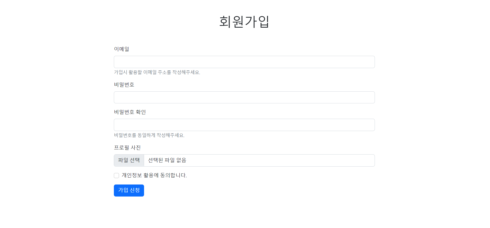
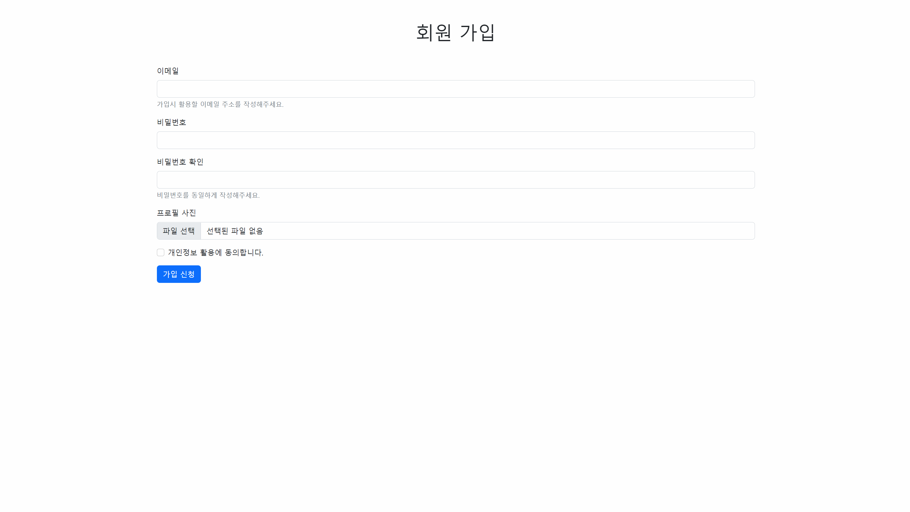
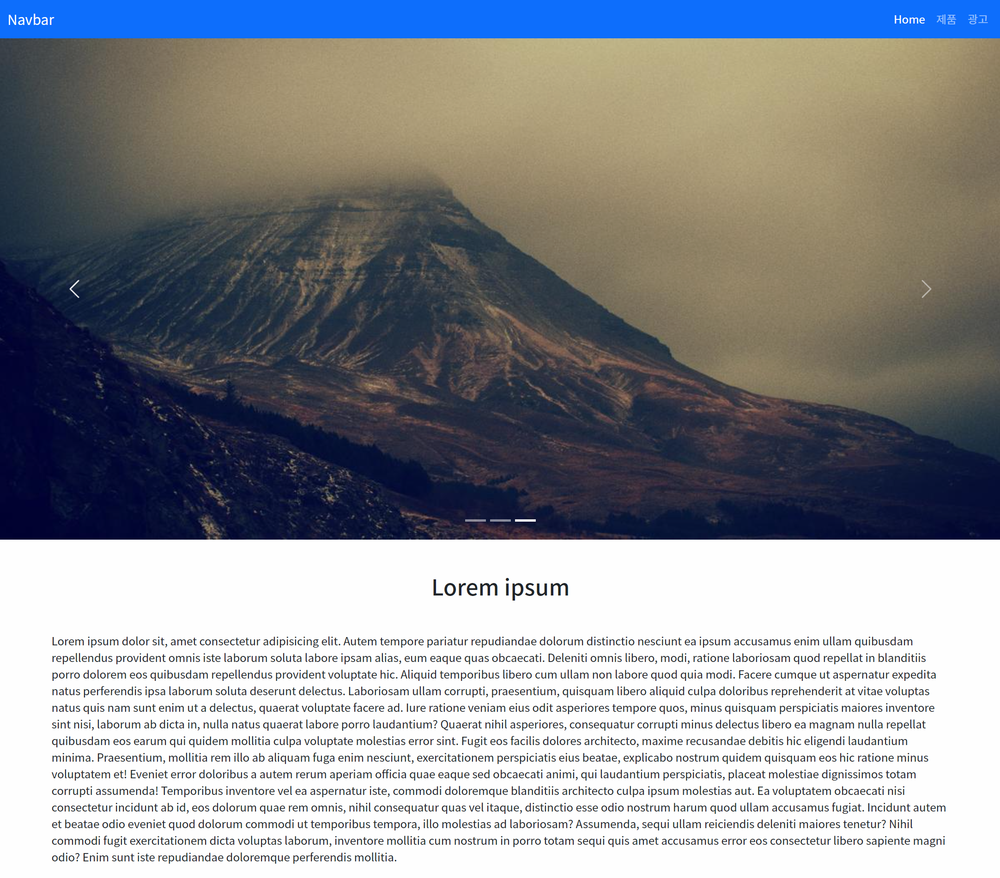

# 0906 웹 Bootstrap 실습
> 모든 과제는 별도의 CSS없이 작성할 수 있지만, 필요한 경우 적절하게 활용합니다.

## 결과물✨
- 회원가입 페이지

- 메인 페이지

## 회원가입 페이지📄

* 전체 영역은 컨테이너(`.container`)로 감싸고 있습니다.

* 회원가입은 `h1` 태그로 가운데 정렬되어 있습니다.

* Bootstrap Form을 활용하여 화면과 동일하게 구성하세요.

## 메인 페이지📄

> 메인 페이지를 만듭니다.

## Navbar

* Nav는 항상 상단에 고정되어 있습니다.

* 배경색은 primary로 적용합니다.

* Home, 제품, 광고 항목은 우측에 배치합니다. 

## Carousel

* 주어진 배경 이미지를 활용하여 적절하게 구성합니다.

## 본문

* 본문 영역은 컨테이너(`.container`)로 감싸고 있습니다.

* `h2` 태그로 제목을 작성하고 가운데 정렬합니다.

* `p`  태그로 내용을 작성합니다. (`lorem300`)